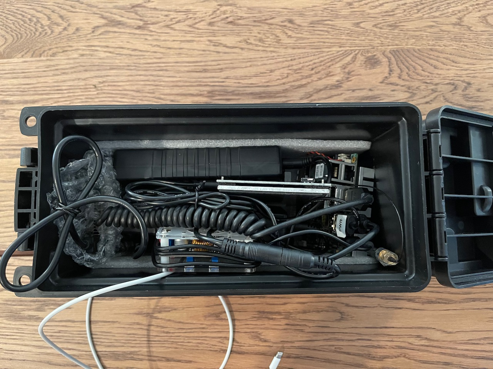

Welcome to Xeno's basic Blue2thprinting setup! It's cheap(ish, other than the small form factor PC) and *good enough* to get started!

# Disclaimer!

This is ***researchware***. Don't expect it to be easy to set up, nor use. The instructions will only be refined for greater ease of use once we begin work on the [OST2](https://ost2.fyi) Bluetooth classes.

# Assumed Hardware
(If you do not have any of the below, you will need to purchase.)

* Keyboard  
* Mouse  
* Monitor with HDMI input (or DVI input and an HDMI adapter. Note: Raspberry Pis have not worked with all monitors / adapter configurations for me.)   


# Recommended Hardware

Note: the below hardware purchase links are Amazon affiliate links that support the [OpenSecurityTraining2](https://ost2.fyi) nonprofit.

---
**Computer**

A small form-factor x86-based PC (because currently Sweyntooth and Braktooth are only available as x86-64 Linux binaries.) You can use a laptop if you want, but I wanted to create a device I could place in a weather-proof container and lock up somewhere and sniff without fear of it being stolen, so this build is based around that assumed form factor.

* 1x - Up Squared (aka UP^2) [Intel Atom® x7-E3950 SKU](https://up-shop.org/default/up-squared-series.html) - \$289 + \$13.99 power supply + \$29.99 "M.2 2230 WiFi kit (RE-WFKIT-9260NVP)"  
* * I used this because I had one laying around because it's a decent test platform if you're interested in using Positive Technologies' [Intel ME Exploit]() (they're still selling permanently vulnerable boards! :D)  
* * Note: Unfortunately this cannot run off a simple USB battery pack. You will need to buy a higher voltage (e.g. 12V) battery and a voltage converter to decrease to ~5.5V.  

* 2x - [12V battery pack](https://amzn.to/3tqAj34) - ~\$40/unit

* 1x - [Voltage converter](https://amzn.to/3tkTew4) - ~\$14/unit

* 1x - [Plugs for voltage converter output](https://amzn.to/3RW5AoS) - ~\$4/unit

* 1x - [Plugs for voltage converter input](https://amzn.to/45wmFsu) - \$7/unit
* * You then need to wire it as 12V battery -> in-plugs -> converter -> out-plugs -> UP^2

---
**Custom packet sending hardware (for Braktooth/Sweyntooth)**

For Braktooth - [ESP-WROVER-KIT](https://www.mouser.com/ProductDetail/Espressif-Systems/ESP-WROVER-KIT-VE?qs=KUoIvG%2F9Ilbci6DcltJYaA%3D%3D&mgh=1&gclid=EAIaIQobChMI1OOewJvugQMVik9HAR0FxgvkEAQYASABEgJ01PD_BwE) - ~\$40/unit

For Sweyntooth - [nRF52840 USB dongle](https://www.mouser.com/ProductDetail/Nordic-Semiconductor/nRF52840-Dongle?qs=gTYE2QTfZfTbdrOaMHWEZg%3D%3D) - ~\$10/unit

---
**Accessories** 

* 1x - [Non-separate-power USB-A hub](https://amzn.to/3qHCkXw) - ~$8/unit
* * Necessary because there's not enough USB ports for everything you need to connect

* 1x - [HDMI-mini male to HDMI female adapter](https://amzn.to/44javCF) - ~$3.50/unit

* 1x - [USB-A GPS receiver](https://amzn.to/44srqCJ) - ~$19/unit
* * Not necessary if you're only going to place sniffers at a single known location. Necessary if you're going to wander around and want to know where something was observed.

---
**Outdoor deployment equipment**

The following are only required if you'll be placing the devices into an outdoor environment for days at a time:

* 1x - [Lockable water-proof outdoor box](https://amzn.to/3OHsSeO) - ~$9/unit

* 1x - [Keyed Padlock](https://amzn.to/3P95PuM) - ~$10/unit

* 1x - [Flexible bike lock](https://amzn.to/3YOu7xf) - ~$9/unit
* * These [aren't particularly secure](https://www.youtube.com/shorts/dA9OsRal_L8), and indeed I forgot my combo at one point and had to pick my own. But they're just there to stop hobos and randos from walking off with your stuff ;).

---
Nice to have:

* 1x - [5" Mini screen](https://amzn.to/3QtlJj1) - ~$39/unit
* * If you are using the device for mobile sniffing, it's desirable to know if it's actually continuing to capture data, or whether it's crashed. You won't be able to tell that without a screen

* 1x - [Short & flexible HDMI cable](https://www.amazon.com/gp/product/B0B5TDFVVW/ref=ppx_yo_dt_b_search_asin_title?ie=UTF8&th=1) for above mini-screen - ~$14/unit

* USB micro male to USB A male cable (to power the mini-screen) - 

---

# Physical hardware setup

**If you bought & set up everything correctly, your setup should look like this**


* Note: This is without the GPS USB connected (for deployment in a fixed location).  
* 1 = "UP^2" above  
* 2 = "M.2 2230 WiFi kit" above  
* 3 = "12V battery pack" above (note, it actually comes with that splitter, for charging and using at the same time, but I use the splitter to connect 2 batteries at once for longer runtime.)  
* 4 = "Plugs for voltage converter input" above  
* 5 = "Voltage converter" above  
* 6 = "Plugs for voltage converter output" above  
* 7 = "Non-separate-power USB-A hub" above  
* 8 = "nRF52840 USB dongle" above  
* 9 = "ESP-WROVER-KIT" above (with USB micro male to USB A male cable (needs data transport))  
* 10 = "5" Mini screen" above  
* 11 = "Short & flexible HDMI cable" above  
* 12 = "USB micro male to USB A male cable" (only needs power transport) above  
* 13 = "Lockable water-proof outdoor box" above  

**Example of how I install the equipment in the box:**

⬆️ Step 1: I put some foam in to padd some components:  


⬆️ Step 2: I place the UP^2 to one side, with the heat-sink facing outward, and one antenna oriented vertically and one horizontally (superstition!) Note, the metal on the antennas is wrapped in tape to avoid it touching any other component's pins.  


⬆️ Step 3: I connect the USB hub to the UP^2. The USB hub has the Nordic USB dongle and wireless mouse dongle plugged in, as well as the ESP-WROVER-KIT data cable. I place the ESP-WROVER-KIT at the opposite side of the box, wrapped in something non-conductive (e.g. bubble wrap in this case), so that its exposed pins don't touch any other components.  


⬆️ Step 4: I connect the keyboard USB cable to the USB hub. And I insert the two 12V batteries, connected via their included splitter. I place the batteries so that there is a gap inbetween them, where the screen will be slotted when not in use later.  


⬆️ Step 5: I connect the 5" screen via HDMI and USB. The screen has a switch to power it off when not in use, which should be flipped to save battery life.  


⬆️ Step 6: I connect the assembled 12V -> 5.5V power converter, connecting one end to the 12V batteries' splitter, and one end to the power of the UP^2.  


⬆️ Step 7: At this point the USB keyboard cord can be coiled in the box, and the box powered on, for portable sniffing or placement at a location for static sniffing.  


⬆️ Step 8: The box can then be opened and the keyboard connected and powered on, the mouse powered on, and screen removed and powered on and it can be interacted with like any other Linux-based PC. The power converted can be disconnected from the splitter connected to the 12V batteries, and a charger connected instead, to charge the 12V batteries once they're dead. Or the device can simply be connected to the UP^2's wall power adapter when experimenting and not needing to run off battery.  

* Note: In principle it's desirable to use a wired mouse/keyboard, *not* wireless ones, to not introduce any additional 2.4GHz interference. On the other hand, I find that using a normal wired mouse is inconvenient if I'm driving around and want to look at something, because there's no decent mousing surfaces. Hence why I use a wireless trackball. (I should probably get a wired trackball.)  

---

# Recommended Software

Install *Ubuntu 22.04* on the UP^2.

# OS Setup & Configuration

### Install prerequisite software:

```
sudo apt-get update
sudo apt-get upgrade -y
sudo apt-get install -y python3-pip tshark mariadb-server gpsd gpsd-clients expect git net-tools openssh-server python2.7
```
Wireshark/tshark/dumpcap will prompt for whether non-super-users should be able to capture packets. Select yes.  

```
sudo pip3 install gmplot inotify_simple
```

**Check out *this repository* to a known location:**  

```
git clone --recurse-submodules https://github.com/darkmentorllc/Blue2thprinting.git ~/Blue2thprinting
```

Ensure that the Bluetooth assigned numbers sub-repository was successfully checked out by confirming that `~/Blue2thprinting/Analysis/public` is not empty.

### Test GPS module:

If you type "gpsmon" at this point, you will not get any coordinates. The presence of coordinates will be our determination of correctness of operation.

*With your GPS module disconnected*, run: `ls -la /dev/ttyACM*`  
 - There should be no such file present. If there is something present, unplug all peripheral devices until you detect which device was causing that. Do not plug that device in again while operating this system.  
 - Plug in your USB GPS antenna, run `ls -la /dev/ttyACM*`  
 - The GPS device should now be visible as /dev/ttyACM0. ***The below will assume that /dev/ttyACM0 is the GPS device.***  

Change two lines from:

```
ListenStream=[::1]:2947
ListenStream=127.0.0.1:2947
```

to

```
#ListenStream=[::1]:2947
ListenStream=0.0.0.0:2947
```
Save the file and exit. (Note: this commented out the IPv6 address.)

```
gpsd /dev/ttyACM0 -F /var/run/gpsd.socket
systemctl daemon-reload
systemctl restart gpsd.socket
systemctl restart gpsd
```
You should now see GPS coordinates (assuming you're somewhere with visibility of the sky or otherwise in GPS range.) If you don't, reboot, and then run "sudo gpsmon" and confirm if you can then. (If you still can't, you're SOL, because Linux GPS has caused me enough trouble, and I'm not debugging yours `¯\_(ツ)_/¯`.)

Ctrl-c to exit gpsmon.

`gpspipe -V`
Confirm you are running version 3.17 (newer versions like 3.22 which is bundled with newer Raspbian OSes have known issues that prevent capturing the coordinates in our usage, with the GPS hardware recommended above.)

### Compile custom BlueZ tools

I collect GATT data via a modified `gatttool` from the BlueZ tools. I also use the unmodified, but not compiled by default, `sdptool` to collect SDP info. If you want to use this, you will have to compile it on the target system (e.g. Raspberry Pi). My modified BlueZ-5.66 code is in this repository in the `bluez-5.66` folder.

Install the prerequisite software for compiling the custom BlueZ:  

```
sudo apt-get install -y libusb-dev libdbus-1-dev libglib2.0-dev libudev-dev libical-dev libreadline-dev autoconf python3-docutils
```

Then issue the following commands to copy the folder to Downloads (where other scripts will assume it's located), and then begin the Makefile generation:  

```
cp -r ~/Blue2thprinting/bluez-5.66 ~/Downloads/bluez-5.66
cd ~/Downloads/bluez-5.66
./configure --prefix=/usr --mandir=/usr/share/man --sysconfdir=/etc --localstatedir=/var --enable-experimental
```
Now you need to edit the Makefile and uncomment every line (and enclosing statement) that has a reference to "gatttool" or "sdptool" on it. (I don't know at the moment how to call ./configure in a way that will include it. If you know, LMK!)  

***Note***: There is one tricky entry with sdptool. When you find the entry under the `am__EXEEXT_6` heading like this...  

```
am__EXEEXT_3 = tools/rctest$(EXEEXT) tools/l2test$(EXEEXT) \
        tools/l2ping$(EXEEXT) tools/bluemoon$(EXEEXT) \
        tools/hex2hcd$(EXEEXT) tools/mpris-proxy$(EXEEXT) \
        tools/btattach$(EXEEXT) tools/isotest$(EXEEXT)
##am__EXEEXT_4 = tools/meshctl$(EXEEXT)
#am__EXEEXT_5 = tools/mesh-cfgclient$(EXEEXT) \
#       tools/mesh-cfgtest$(EXEEXT)
#am__EXEEXT_6 = tools/hciattach$(EXEEXT) \
#       tools/hciconfig$(EXEEXT) \
#       tools/hcitool$(EXEEXT) \
#       tools/hcidump$(EXEEXT) \
#       tools/rfcomm$(EXEEXT) \
#       tools/sdptool$(EXEEXT) \
```

don't uncomment everything in `am__EXEEXT_6` (to not introduce more prerequisites), just modify the `am__EXEEXT_3 entry` (don't forget to add \ at the end of the line before the sdptool line too):

```
am__EXEEXT_3 = tools/rctest$(EXEEXT) tools/l2test$(EXEEXT) \
        tools/l2ping$(EXEEXT) tools/bluemoon$(EXEEXT) \
        tools/hex2hcd$(EXEEXT) tools/mpris-proxy$(EXEEXT) \
        tools/btattach$(EXEEXT) tools/isotest$(EXEEXT) \
        tools/sdptool$(EXEEXT)
```


If you have a username other than 'pi', update `~/Downloads/bluez-5.66/attrib/gatttool.c` and `~/Downloads/bluez-5.66/tools/sdptool.c` to correct the path in `g_log_name`.

```
make -j4
```

At the end you should confirm it has built by running the following commands:

```
~/Downloads/bluez-5.66/attrib/gatttool --help
~/Downloads/bluez-5.66/tools/sdptool --help
```

If there is an error of "Failed to open the file.", that means you failed to update the username in the `g_log_name` variable as mentioned above (or perhaps it already exists but you don't have permission because it was created by root.)

Custom BlueZ compilation will also build a custom `~/Downloads/bluez-5.66/client/bluetoothctl` which has an output format that's parsed by `central_app_launcher2.py`.

### Setup Braktooth

Place the Braktooth code in the location assumed by `central_app_launcher2.py`:  

```
cd ~/Downloads
git clone https://github.com/Matheus-Garbelini/braktooth_esp32_bluetooth_classic_attacks.git
```

You are required to setup Braktooth to work **[per the "Installation instructions" in the Braktooth repository](https://github.com/Matheus-Garbelini/braktooth_esp32_bluetooth_classic_attacks)**. 

**Known issues with instructions:** 

**1)** The `wdissector.tar.zst` in the root of the folder isn't the full 300MB+ file; it instead needs to be grabbed from the [artifact release](https://github.com/Matheus-Garbelini/braktooth_esp32_bluetooth_classic_attacks/releases/download/v1.0.1/release.zip).

**2)** Because the instructions are for Ubuntu 18.04, on Ubuntu 22.04 you will need to issue the following commands to install the missing "libssl.so.1.1" and "libcrypto.so.1.1" shared libraries, to make the pre-compiled `braktooth_esp32_bluetooth_classic_attacks/wdissector/bin/bt_exploiter` binary work:

```
wget http://archive.ubuntu.com/ubuntu/pool/main/o/openssl/libssl1.1_1.1.0g-2ubuntu4_amd64.deb
sudo dpkg -i libssl1.1_1.1.0g-2ubuntu4_amd64.deb
```

**3)** Modify the following file to make it so that the `LMP2thprint.cpp` will compile properly.

In `~/Downloads/braktooth_esp32_bluetooth_classic_attacks/wdissector$ nano src/ModulesInclude.hpp`, replace all the instances of "extern", with "static", as shown below. 

Replace

```
extern const char *module_name();
// Setup
extern int setup(void *p);
// TX Pre
extern int tx_pre_dissection(uint8_t *pkt_buf, int pkt_length, void *p);
// TX Ppost
extern int tx_post_dissection(uint8_t *pkt_buf, int pkt_length, void *p);
// RX Pre
extern int rx_pre_dissection(uint8_t *pkt_buf, int pkt_length, void *p);
// RX Post
extern int rx_post_dissection(uint8_t *pkt_buf, int pkt_length, void *p);
```

with

```
static const char *module_name();
// Setup
static int setup(void *p);
// TX Pre
static int tx_pre_dissection(uint8_t *pkt_buf, int pkt_length, void *p);
// TX Ppost
static int tx_post_dissection(uint8_t *pkt_buf, int pkt_length, void *p);
// RX Pre
static int rx_pre_dissection(uint8_t *pkt_buf, int pkt_length, void *p);
// RX Post
static int rx_post_dissection(uint8_t *pkt_buf, int pkt_length, void *p);
```

**Manually confirm that Braktooth is working before attempting to run it from within central_app_launcher2.py:**

If you have a username other than 'pi', update `~/Blue2thprint/Braktooth_module/LMP2thprint.cpp` to correct the path in the `BTC2TH_LOG_PATH` variable.

```
cd ~/Downloads/braktooth_esp32_bluetooth_classic_attacks
cp ~/Blue2thprint/Braktooth_module/LMP2thprint.cpp ~/Downloads/braktooth_esp32_bluetooth_classic_attacks/wdissector/modules/exploits/bluetooth/
sudo ~/Downloads/braktooth_esp32_bluetooth_classic_attacks/wdissector/bin/bt_exploiter --exploit=LMP2thprint --target=AA:BB:CC:11:22:33
```

Of course, replace `AA:BB:CC:11:22:33` with the BTC BDADDR you want to target.

Once you have confirmed this works, you should set `btc_2thprint_enabled = True` in `~/central_app_launcher2.py`.

### Setup Sweyntooth

Place the Sweyntooth code in the location assumed by `central_app_launcher2.py`:  

```
cp -r ~/Blue2thprint/sweyntooth_bluetooth_low_energy_attacks ~/Downloads/sweyntooth_bluetooth_low_energy_attacks
```

You are required to setup Sweyntooth to work **[by following the instructions in the Sweyntooth repository](https://github.com/Matheus-Garbelini/sweyntooth_bluetooth_low_energy_attacks)**. 

Once you get the custom firmware onto the Nordic device, the theoretical minimal instructions to make this local copy of Sweyntooth work are as follows:

```
cd ~/Downloads/sweyntooth_bluetooth_low_energy_attacks
sudo apt-get install python2.7
wget -c https://bootstrap.pypa.io/pip/2.7/get-pip.py
python2.7 get-pip.py
# It will then warn you that it installed pip2.7 in a location that's not in your path, e.g. /home/pi/.local/bin/. Add that location to your PATH with "export PATH=$PATH:/home/pi/.local/bin/"
pip2.7 install -r requirements.txt
```

**Manually confirm that Sweyntooth is working before attempting to run it from within central_app_launcher2.py:**

If you're using a username other than "pi", edit the `BLE2TH_LOG_PATH` variable in `~/Downloads/sweyntooth_bluetooth_low_energy_attacks/LL2thprint.py`.

```
cd ~/Downloads/sweyntooth_bluetooth_low_energy_attacks
sudo -E python2.7 LL2thprint.py /dev/ttyACM0 AA:BB:CC:11:22:33
```

Of course, replace `AA:BB:CC:11:22:33` with the BLE BDADDR you want to target, and `/dev/ttyACM0` with the correct TTY device (but that should be it by default if you don't e.g. have the GPS plugged in before it.)

Once you have confirmed this works, you should set `ble_2thprint_enabled = True` in `~/central_app_launcher2.py`.

# Capture Scripts Setup

### Setup automatic script execution at boot:
Download the "Scripts" folder from this repository into /home/pi/ home directory.

```
cp ~/Scripts/central_app_launcher2.py ~/central_app_launcher2.py
sudo su
cd Scripts
chmod +x *.sh
crontab -e
```
Select nano, the best editor! :P  
Add to the bottom of the file:  
`@reboot /home/pi/Scripts/runall.sh`  
Save and exit  
`sudo reboot`  
After the system comes back up, run:  
`cd Scripts`  
`./check.sh`  
If you are too quick, you will see things like `start_btmon.sh`, `start_bluetoothctl.sh`, or `start_gpspipe.sh`.  
But after their sleep timers have expired, they will transition to things like:

```
root      1506  0.3  0.5   5216  2268 pts/0    S    01:12   0:00 /usr/bin/gpspipe -p -w -T +%F %H:%M:%S -o /home/pi/Scripts/logs/gpspipe/2023-08-24-01-11-38_pi0-2.txt
root      1871  0.0  0.4   7328  1940 pts/0    S+   01:12   0:00 grep gpspipe
root      1504  0.6  0.4   2780  1960 pts/0    S    01:12   0:00 /usr/bin/btmon -T -w /home/pi/Scripts/logs/btmon/2023-08-24-01-11-38_pi0-2.bin
root      1873  0.0  0.4   7328  2020 pts/0    S+   01:12   0:00 grep btmon
root      1510  0.3  0.7   6740  3204 pts/0    S    01:12   0:00 /usr/bin/bluetoothctl scan on
root      1875  0.0  0.4   7328  2016 pts/0    S+   01:12   0:00 grep bluetoothctl
```
If your GPS is plugged in and working correctly, you should see all 3 of those sort of commands. From now on, whenever you reboot, the data collection will begin automatically.

You can cancel collection by running: `sudo ./killall.sh` from the Scripts folder.

If you want to manually restart the collection without a reboot, you can run: `sudo ./runall.sh` from the Scripts folder.

# Analysis Scripts Usage

After you have sniffed some traffic, you will have files in /home/pi/Scripts/logs/btmon/ and /home/pi/Scripts/logs/gpspipe/, that should be named the same as each other (timestamp followed by hostname) except that GPS files end in .txt and btmon in .bin.

**Note:** Because data parsing and database lookups can be CPU/IO intensive, it is generally recommended to *not* perform data import or analysis on the capture device (the UP^2 in this case.) Rather, it is recommended to copy all data off to a separate, faster, analysis system, and perform the subsequent steps there.

### delete\_gps\_files\_lacking\_lat\_long.py

Often the GPS log will be continuing to log metadata even when it can't get a GPS coordinate fix. You should periodically deliminate any useless files that have no lat/long coordinates by running the following:

```
python3 delete_gps_files_lacking_lat_long.py /home/pi/Scripts/logs/gpspipe/
```

Any files that are deleted will be printed out. No output means no files were deleted.

### dump\_names\_specific.sh

Assume we have the following files:

```
root@pi0-2:/home/pi/Scripts# ls logs/btmon/
2023-08-24-01-04-59_pi0-2.bin  2023-08-24-01-11-38_pi0-2.bin
```

The named bluetooth devices found in multiple files can be dumped to stdout as follows:

```
./dump_names_specific.sh 2023-08-24-01-04-59_pi0-2.bin 2023-08-24-01-11-38_pi0-2.bin
Processing  /home/pi/Scripts/logs/btmon/2023-08-24-01-04-59_pi0-2.bin
btmon -T -r /home/pi/Scripts/logs/btmon/2023-08-24-01-04-59_pi0-2.bin.bin | grep -e "Name (.*):" | sort | uniq
Processing  /home/pi/Scripts/logs/btmon/2023-08-24-01-11-38_pi0-2.bin
btmon -T -r /home/pi/Scripts/logs/btmon/2023-08-24-01-11-38_pi0-2.bin.bin | grep -e "Name (.*):" | sort | uniq
All found names:
        Name (complete): This_is-not_real
        Name (complete): Neither is this😎
        Name (complete): BecauseWiGLEWouldTellYouWhereILive:P
```
from within the Scripts folder.

*Note:* The accepted name format is just the filename, not the full path. 

### map\_specific.sh

Assume we have the following files:

```
pi@pi0-2:~/Scripts $ ls logs/gpspipe/
2023-08-24-01-04-59_pi0-2.txt  2023-08-24-01-11-38_pi0-2.txt
```

If you have a file like `/home/pi/Scripts/logs/gpspipe/2023-08-24-01-11-38_pi0-2.txt` for instance, you can map the instances of *named* bluetooth devices. 

```
root@pi0-2:/home/pi/Scripts# ./map_specific.sh 2023-08-24-01-04-59_pi0-2 2023-08-24-01-11-38_pi0-2
passed in 
Processing  2023-08-24-01-04-59_pi0-2
Running as user "root" and group "root". This could be dangerous.
Processing  2023-08-24-01-11-38_pi0-2
Running as user "root" and group "root". This could be dangerous.
Adding markers

Done

root@pi0-2:/home/pi/Scripts# ls -la bt_map.html 
-rw-r--r-- 1 root root 9012 Aug 24 01:31 bt_map.html
```

The file bt_map.html can be opened in a browser to see the GPS locations of named devices.

*Note:* The accepted name format is just the filename, not the full path. You must remove the filetype suffix like ".txt" or ".bin".

## Import data into MySQL

**Note:** Because data parsing and database lookups can be CPU/IO intensive, it is generally recommended to *not* perform data import or analysis on the capture device (the UP^2 in this case.) Rather, it is recommended to copy all data off to a separate, faster, analysis system, and perform the subsequent steps there.

### One time setup

**Linux Software Setup**: You should already have the necessary MySQL (MariaDB) database and tshark tools installed from the above apt-get commands.

**macOS Software Setup**: You can load the data into the database and perform analysis on macOS, but you must first [install HomeBrew](https://brew.sh/), and then run `brew install mysql` and `brew install wireshark` (for the `tshark` CLI version). (If for some reason neither tshark nor wireshark are found in your PATH, look in / add from /usr/local/Cellar/wireshark/). Then also edit `/usr/local/etc/my.cnf` and add `secure_file_priv = /tmp` at the end of the file, and then start the mysql server with `/usr/local/opt/mysql/bin/mysqld_safe --datadir=/usr/local/var/mysql`.

**Create initial database & tables**:

To create the "bt" database and all the necessary tables, run the following:  

```
cd ~/Blue2thprinting/Analysis
sudo ./create_all_db_tables.sh
```

**Import the IEEE OUIs into the database**:

```
cd ~/Blue2thprinting/Analysis
./process_OUI_lists.sh ./oui.txt
```

The oui.txt is from [https://standards-oui.ieee.org/oui/oui.txt](https://standards-oui.ieee.org/oui/oui.txt), and should be periodically updated. Also note that the `process_OUI_lists.sh` script does not currently handle OUI assignments that are less than 24 bits ([tracking issue](https://github.com/darkmentorllc/naiveBTsniffing/issues/1)).

**Import BT companies into the database**:

```
cd ~/Blue2thprinting/Analysis`
./translator_fill_UUID16_to_company.sh
```

This should be re-run if you ever do a "git pull" in the `Blue2thprinting/public` directory, which contains the Bluetooth Assigned Numbers information, to get updated assigned vendor UUID16s.

### Importing data from btmon .bin files

`cd ~/Blue2thprinting/Analysis`

Run `./fill_ALL_from_HCI_log.sh {your_btmon_file.bin}`.

E.g. `./fill_ALL_from_HCI_log.sh ../ExampleData/2023-10-06-08-52-20_up-apl01.bin`

You should see a variety of outputs such as "tsharking", and "mysql import". You can safely ignore any tshark warnings about the file being "cut short in the middle of a packet".

Eventually once you have many files to process in bulk, you will want to pass each file to `fill_ALL_from_HCI_log.sh` sequentially. For that you can issue a command like:

`time find /path/to/btmon_logs/2023-10* -type f -name "*.bin" | xargs -n 1 -I {} bash -c " ./fill_ALL_from_HCI_log.sh {}"`

**To confirm that some data was successfully imported, you can issue:**

```
mysql -u user -pa -D bt -e "SELECT * FROM LE_bdaddr_to_name LIMIT 10;"
```

This should show some of the same sort of device name data that you could see by the above `./dump_names_specific.sh` command.

### Importing GATT data from GATTprint.log

Both `central_all_launcher2.py` and `gatttool` log information about attempted and successful GATTprinting to the file `/home/pi/GATTprint.log` (or alt user home directory if you reconfigured it). To import this data into the database, run the following:

```
cp ~/Blue2thprinting/Analysis/parse_GATTPRINT_2db.py ~/
cd ~
cat GATTprint*.log | sort | uniq > GATTprint_dedup.log
python3 ./parse_GATTPRINT_2db.py
```

The above `cat` step is useful both to speed up the parsing of a single host's data (if it queried the same host multiple times), but also to combine data from multiple hosts, and avoid unnecessary duplicative mysql imports.

**To confirm that some data was successfully imported, you can issue:**

```
mysql -u user -pa -D bt -e "SELECT * FROM GATT_characteristics LIMIT 10;"
```

### Importing BLE LL data from BLE_2THPRINT.log

Both `central_all_launcher2.py` and my `LL2thprint.py` Sweyntooth module log information about attempted and successful LL2thprint to the file `/home/pi/BLE_2THPRINT.log` (or alt user home directory if you reconfigured it). To import this data into the database, run the following:

```
cp ~/Blue2thprinting/Analysis/parse_BLE_2THPRINT_2db.py ~/
cd ~
cat BLE_2THPRINT*.log | sort | uniq > BLE_2THPRINT_dedup.log
python3 ./parse_BLE_2THPRINT_2db.py
```

The above `cat` step is useful both to speed up the parsing of a single host's data (if it queried the same host multiple times), but also to combine data from multiple hosts, and avoid unnecessary duplicative mysql imports.

**To confirm that some data was successfully imported, you can issue:**

```
mysql -u user -pa -D bt -e "SELECT * FROM BLE2th_LL_VERSION_IND LIMIT 10;"
```

### Importing BTC LMP data from BTC_2THPRINT.log

Both `central_all_launcher2.py` and my `LMP2thprint.cpp` Braktooth module log information about attempted and successful LL2thprint to the file `/home/pi/BTC_2THPRINT.log` (or alt user home directory if you reconfigured it). To import this data into the database, run the following:

```
cp ~/Blue2thprinting/Analysis/parse_BTC_2THPRINT_2db.py ~/
cd ~
python3 ./parse_BTC_2THPRINT_2db.py
```

Unfortunately no deduplication of data is possible currently due to the fact that I don't know how to obtain the BDADDR from within Braktooth and add it to every log line. If you know how, LMK! Because currently this is dependent on `central_all_launcher2.py` prepending log entries to let the parsing know what BDADDR the subsequent data is for.

**To confirm that some data was successfully imported, you can issue:**

```
mysql -u user -pa -D bt -e "SELECT * FROM BTC2th_LMP_version_res LIMIT 10;"
```

## Inspecting data with TellMeEverything.py

`cd ~/Blue2thprinting/Analysis`

You will need Python3 installed, and you may need to change the path to the python3 interpreter at the beginning of the file. You will also need to do `pip3 install mysql-connector-python`, `pip3 install pyyaml` if you have not already.

Issue `python3 ./TellMeEverything.py --help` for the latest usage.

**If you get an error like "public/path/something can't be found"**, make sure your `~/Blue2thprinting/Analysis/public` folder is not empty. If it is empty, that implies you didn't check out the Bluetooth assigned numbers sub-module at git repository clone time. This can be corrected by issuing `git submodule update --init --recursive`.

**Printing information for a specific BDADDR**:

`python3 ./TellMeEverything.py --bdaddr 4c:e6:c0:21:39:a6`

**Printing information for BDADDRs that have a name that matches a given regex**:

`python3 ./TellMeEverything.py --nameregex "^Flipper"`

The regex is used as a MySQL "REGEXP" statement, and thus must be valid MySQL regex syntax.

**Printing information for BDADDRs that have some data element that is associated with a company name that matches a given regex**:

`python3 ./TellMeEverything.py --nameregex "^Qualcomm"`

The regex is checked against associations with the BDADDR IEEE OUI, UUID16s, and BT/BLE CompanyID fields from link layer version information.

**Printing information for BDADDRs that have a UUID128 that matches a given regex**:

`python3 ./TellMeEverything.py --UUID128regex "02030302"`

**Printing information for BDADDRs that have Manufacturer Specific Data that matches a given regex**:

`python3 ./TellMeEverything.py --MSDregex "008fc3d5"`
